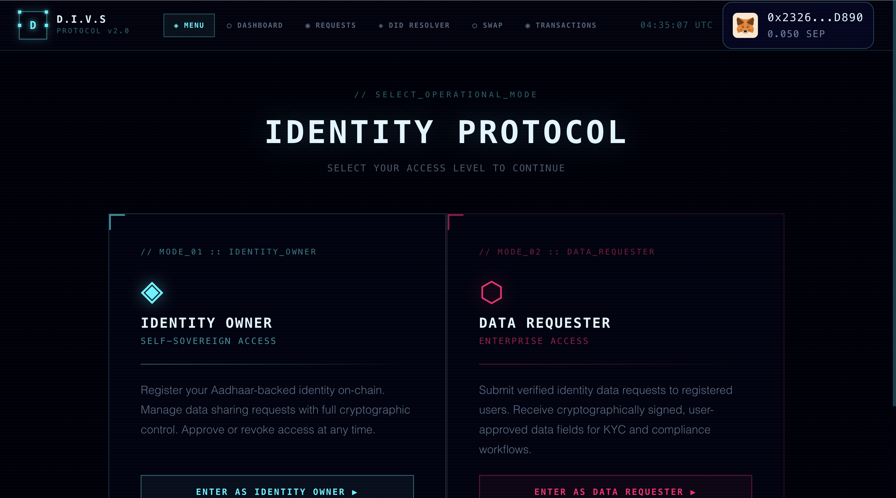
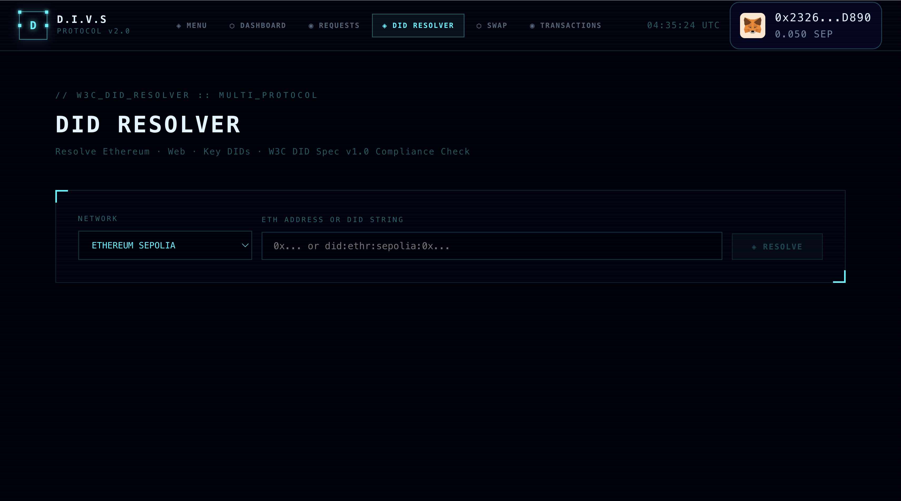
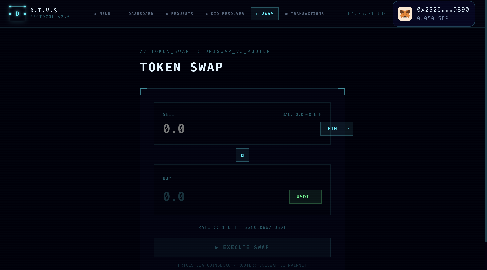
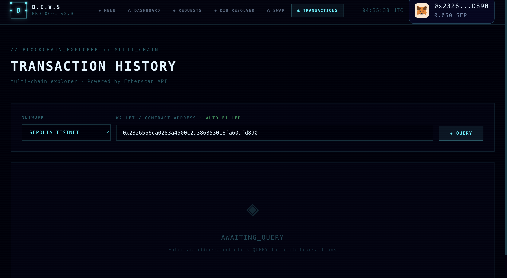
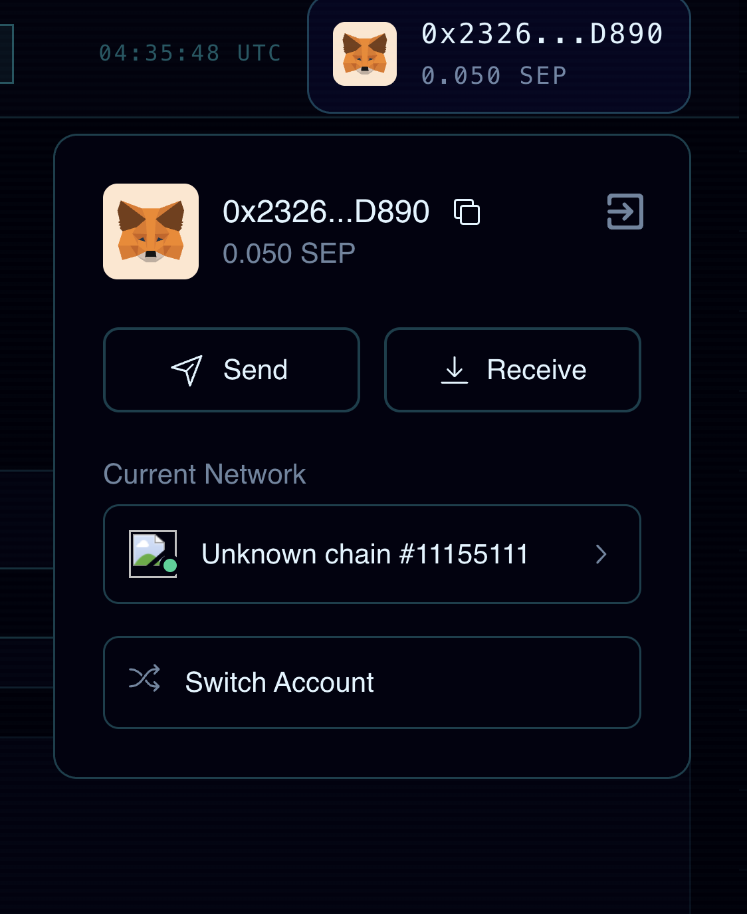

<div align="center">

<!-- BANNER -->


<br/>

```
██████╗ ██╗    ██╗   ██╗███████╗
██╔══██╗██║    ██║   ██║██╔════╝
██║  ██║██║    ██║   ██║███████╗
██║  ██║██║    ╚██╗ ██╔╝╚════██║
██████╔╝██║     ╚████╔╝ ███████║
╚═════╝ ╚═╝      ╚═══╝  ╚══════╝
```

# DECENTRALIZED IDENTITY VERIFICATION SYSTEM

**Enterprise-grade · Blockchain-Anchored · Self-Sovereign Identity Protocol**

<br/>

[](https://sepolia.etherscan.io)
[](https://ipfs.io)
[](https://metamask.io)
[](https://reactjs.org)
[](https://soliditylang.org)
[](https://www.w3.org/TR/did-core/)

[](./LICENSE)
[](https://sepolia.etherscan.io)
[](#)

</div>

---

## 📸 Screenshots

<div align="center">

### 🏠 Landing Page


### 🔐 Identity Registration


### 👤 User Dashboard


### 📋 Data Requests


### 🌐 DID Resolver


### 💱 Token Swap


### 📊 Transaction History


</div>

---

## 🌟 What is D.I.V.S?

**D.I.V.S** (Decentralized Identity Verification System) is an enterprise-level, blockchain-native identity protocol that gives individuals complete ownership of their digital identity — with zero central authority, zero data breaches, and full cryptographic enforcement.

> *"Your identity. Your keys. Your rules."*

Built for a world where identity should be **self-sovereign**, verifiable, and privacy-preserving by default.

---

## ⚡ Core Features

| Module | Description |
|--------|-------------|
| 🔐 **Self-Sovereign Identity** | No central database. You own your identity on-chain. |
| ⛓️ **Blockchain Anchored** | Every identity hash permanently recorded on Ethereum Sepolia. |
| 🔒 **MetaMask Encryption** | X25519-XSalsa20-Poly1305 — military-grade encryption via MetaMask. |
| 🌐 **W3C DID Compliant** | Fully compliant with W3C Decentralized Identifiers v1.0 spec. |
| 📡 **IPFS Distributed Storage** | Encrypted data stored on InterPlanetary File System via Pinata. |
| 🛡️ **Selective Disclosure** | Approve only specific fields per requester — never the full dataset. |
| 🔍 **Multi-Chain Explorer** | Transaction history across Ethereum, Sepolia, Polygon and more. |
| 💱 **Token Swap** | In-built Uniswap V3 token swap interface with live CoinGecko prices. |
| 📄 **Aadhaar Integration** | AI-OCR extracts and verifies identity from government-issued PDFs. |
| 🌐 **DID Resolver** | Resolve `did:ethr`, `did:web`, and `did:key` with W3C validation. |

---

## 🏗️ Architecture

```
┌─────────────────────────────────────────────────────────────┐
│                        FRONTEND (React)                     │
│  Homepage → Register → User/Requester → Dashboard → Swap    │
└──────────────────────┬──────────────────────────────────────┘
                       │
         ┌─────────────┴─────────────┐
         │                           │
┌────────▼────────┐       ┌──────────▼──────────┐
│  Smart Contracts │       │   Backend (Flask)    │
│  (Solidity 0.8) │       │  Aadhaar OCR Server  │
│                 │       │  W3C DID Validator   │
│ IdentityContract│       └──────────┬───────────┘
│ DataRequestCont.│                  │
└────────┬────────┘                  │
         │                           │
┌────────▼────────┐       ┌──────────▼───────────┐
│ Ethereum Sepolia│       │   IPFS via Pinata     │
│  (On-Chain IDs) │       │ (Encrypted Payloads)  │
└─────────────────┘       └──────────────────────┘
```

---

## 🔄 How It Works

```
STEP 01  ──────────────────────────────────────────────────────
         UPLOAD & EXTRACT
         Upload Aadhaar PDF → AI-OCR extracts identity fields
         (Name, DOB, Gender, Phone, Address, Aadhaar Number)

STEP 02  ──────────────────────────────────────────────────────
         ENCRYPT & SIGN
         MetaMask generates X25519 key pair
         Identity JSON encrypted → only your wallet can decrypt

STEP 03  ──────────────────────────────────────────────────────
         DISTRIBUTE TO IPFS
         Encrypted payload pinned to IPFS via Pinata
         CID hash recorded permanently on Ethereum Sepolia

STEP 04  ──────────────────────────────────────────────────────
         SELECTIVE DISCLOSURE
         Requesters submit field-specific on-chain requests
         You approve / reject each one individually
         Approved data re-encrypted for requester's public key
```

---

## 🛠️ Tech Stack

| Layer | Technology |
|-------|-----------|
| **Frontend** | React 18 + Vite + Thirdweb SDK |
| **Styling** | Orbitron + Exo 2 fonts · Custom CSS Design System |
| **Blockchain** | Ethereum Sepolia Testnet |
| **Smart Contracts** | Solidity 0.8.18 · Hardhat · Ethers.js v6 |
| **Wallet** | MetaMask · Thirdweb ConnectWallet |
| **Storage** | IPFS · Pinata |
| **Encryption** | MetaMask `eth_getEncryptionPublicKey` · X25519-XSalsa20-Poly1305 |
| **Identity Standard** | W3C DID v1.0 · `did:ethr` · `did:web` · `did:key` |
| **OCR Backend** | Python · Flask · Google Vision API · Tesseract |
| **DID Resolution** | Infura · ethr-did-resolver · web-did-resolver |
| **Price Oracle** | CoinGecko API |
| **DEX** | Uniswap V3 Router |
| **Explorer** | Etherscan API (Multi-chain) |

---

## 🚀 Quick Start

### Prerequisites

- [Node.js](https://nodejs.org) v18+
- [MetaMask](https://metamask.io/download/) browser extension
- [Python 3.9+](https://python.org) (for backend OCR)
- Sepolia testnet ETH — get free from [sepoliafaucet.com](https://sepoliafaucet.com)

### 1. Clone the Repository

```bash
git clone https://github.com/Incognitoanshh/Decentralized-Identity-Verification-System.git
cd Decentralized-Identity-Verification-System
```

### 2. Run the Automated Setup

```bash
# From the root — runs npm install + creates .env
bash setup.sh
```

### 3. Configure Environment Variables

Create a `.env` file in the frontend root:

```env
# Thirdweb
VITE_REACT_APP_CLIENT_ID=your_thirdweb_client_id

# Smart Contracts (fill after deploying)
VITE_IDENTITY_CONTRACT=0xYourIdentityContractAddress
VITE_DATA_REQUEST_CONTRACT=0xYourDataRequestContractAddress

# Pinata IPFS
VITE_PINATA_JWT=Bearer eyJhbGci...

# Etherscan
VITE_ETHERSCAN_API_KEY=your_etherscan_api_key

# Infura (DID Resolver)
VITE_INFURA_KEY=your_infura_project_id
```

### 4. Deploy Smart Contracts

```bash
cd backend
npm install

# Create backend .env
echo "SEPOLIA_RPC_URL=https://sepolia.infura.io/v3/YOUR_KEY" >> .env
echo "PRIVATE_KEY=your_metamask_private_key" >> .env
echo "ETHERSCAN_API_KEY=your_etherscan_key" >> .env

# Deploy to Sepolia
npx hardhat run scripts/deploy.js --network sepolia
```

> Copy the deployed addresses into your frontend `.env`.

### 5. Start the Backend (OCR Server)

```bash
cd backend
pip install -r requirements.txt
node server.js
# Runs on http://localhost:5000
```

### 6. Start the Frontend

```bash
npm run dev
# Opens at http://localhost:5173
```

---

## 📁 Project Structure

```
Decentralized-Identity-Verification-System/
│
├── src/
│   ├── components/
│   │   ├── Homepage.jsx          # Landing page with animations
│   │   ├── Navbar.jsx            # Sticky navbar with live clock
│   │   ├── SelectModal.jsx       # User / Requester role selector
│   │   ├── PDFUpload.jsx         # Aadhaar PDF drag-drop uploader
│   │   ├── Encrypt.jsx           # MetaMask encrypt + IPFS upload
│   │   ├── UserPage.jsx          # Identity card on-chain view
│   │   ├── UserDashboard.jsx     # Approve / reject requests
│   │   ├── RequesterCardUI.jsx   # Submit data requests
│   │   ├── ApprovedDataPage.jsx  # Fetch approved identity data
│   │   ├── TransactionHistory.jsx # Multi-chain tx explorer
│   │   ├── UNVResolver.jsx       # W3C DID resolver
│   │   ├── UNVSwap.jsx           # Uniswap V3 token swap
│   │   ├── Register.jsx          # DID key manager
│   │   ├── FetchIPFSData.jsx     # Multi-gateway IPFS fetcher
│   │   ├── Decrypt.jsx           # MetaMask eth_decrypt helper
│   │   ├── IPFSutils.jsx         # Pinata upload utility
│   │   └── LoadingSpinner.jsx    # Sci-fi loading animation
│   │
│   ├── App.jsx                   # Main router + state management
│   ├── main.jsx                  # Entry point
│   └── index.css                 # Global cyber design system
│
├── backend/
│   ├── contracts/
│   │   ├── IdentityContract.sol
│   │   └── EnhancedDataRequestContract.sol
│   ├── scripts/deploy.js
│   ├── server.js                 # Flask OCR API server
│   └── hardhat.config.js
│
├── screenshot/                   # App screenshots
├── setup.sh                      # One-command setup script
└── README.md
```

---

## 🔐 Security Model

```
┌─────────────────────────────────────────────────────────┐
│                   SECURITY LAYERS                       │
├─────────────────────────────────────────────────────────┤
│  Layer 1 │ MetaMask X25519 Asymmetric Encryption        │
│  Layer 2 │ IPFS Content-Addressed Storage (CID)         │
│  Layer 3 │ Ethereum On-Chain Hash Verification          │
│  Layer 4 │ Smart Contract Permission Control            │
│  Layer 5 │ Selective Per-Field Disclosure               │
└─────────────────────────────────────────────────────────┘
```

- **No plaintext ever stored** — data is encrypted before leaving the browser
- **No central server** — storage is fully decentralized on IPFS
- **No unauthorized access** — only MetaMask `eth_decrypt` can read your data
- **No data leakage** — requesters only receive fields you explicitly approve

---

## 📜 Smart Contracts

| Contract | Description | Network |
|----------|-------------|---------|
| `IdentityContract.sol` | Registers users, stores IPFS CIDs, manages public keys | Ethereum Sepolia |
| `EnhancedDataRequestContract.sol` | Manages data requests, approvals, and rejections | Ethereum Sepolia |

### Key Contract Functions

```solidity
// Register identity on-chain
function registerUser(string memory ipfsHash, string memory publicKey) external

// Request specific data fields from a user
function requestData(address user, string[] memory fields) external

// Approve a pending request (re-encrypts for requester)
function approveRequest(uint256 requestId) external

// Reject a pending request
function rejectRequest(uint256 requestId) external
```

---

## 🌐 Live Features

| Feature | Status |
|---------|--------|
| Aadhaar PDF OCR Extraction | ✅ Live |
| MetaMask Encryption / Decryption | ✅ Live |
| IPFS Upload via Pinata | ✅ Live |
| On-chain Identity Registration | ✅ Live |
| Data Request / Approve / Reject | ✅ Live |
| W3C DID Resolution | ✅ Live |
| Multi-chain Transaction Explorer | ✅ Live |
| Token Swap (Uniswap V3) | ✅ Live |
| DID Key Manager | ✅ Live |

---

## 🤝 Contributing

Contributions are welcome! Here's how:

```bash
# 1. Fork the repository
# 2. Create your feature branch
git checkout -b feature/your-feature-name

# 3. Commit your changes
git commit -m "feat: add your feature"

# 4. Push to branch
git push origin feature/your-feature-name

# 5. Open a Pull Request
```

---

## 📄 License

This project is licensed under the **MIT License** — see the [LICENSE](./LICENSE) file for details.

---

## 🙏 Acknowledgements

- [Thirdweb](https://thirdweb.com) — Wallet connection infrastructure
- [Pinata](https://pinata.cloud) — IPFS pinning service
- [Infura](https://infura.io) — Ethereum RPC & DID resolution
- [Etherscan](https://etherscan.io) — Blockchain explorer API
- [CoinGecko](https://coingecko.com) — Real-time crypto price feeds
- [Uniswap](https://uniswap.org) — Decentralized exchange protocol
- [W3C DID Working Group](https://www.w3.org/2019/did-wg/) — Decentralized Identifiers standard

---

<div align="center">

**Built with ◈ by [Incognitoanshh](https://github.com/Incognitoanshh)**

*Zero Trust · Zero Middlemen · Cryptographically Enforced*

[](https://github.com/Incognitoanshh)

</div>
